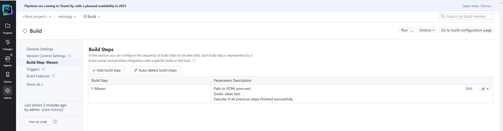
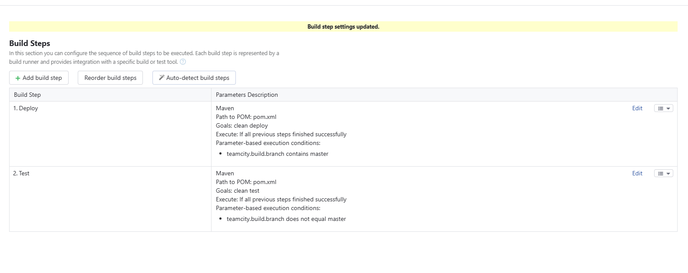
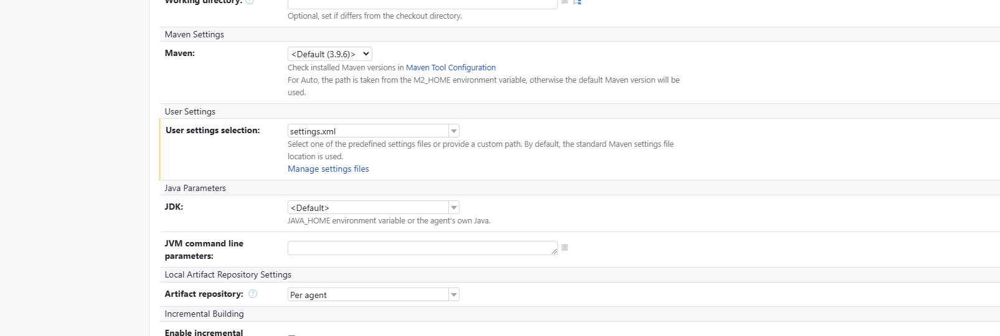
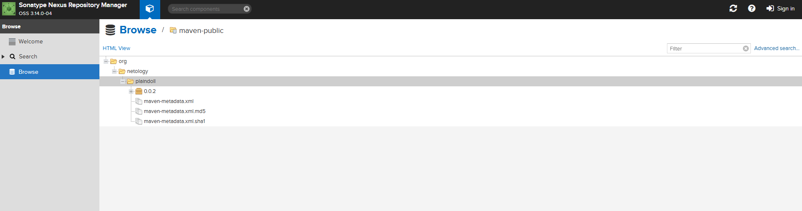
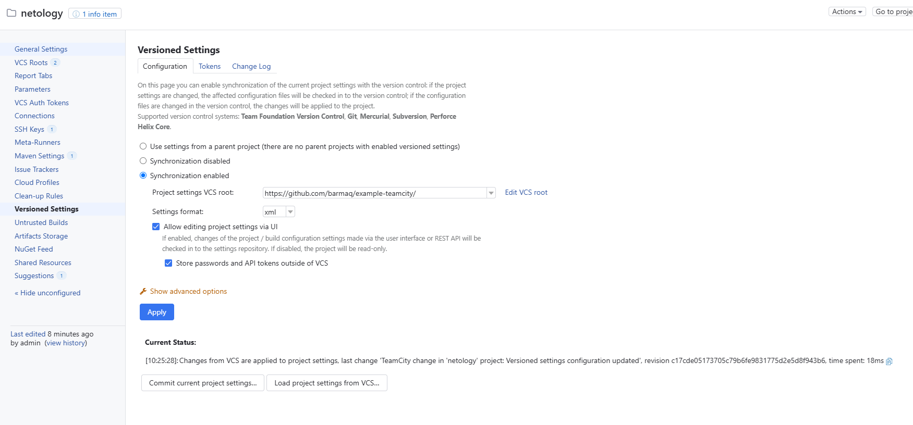
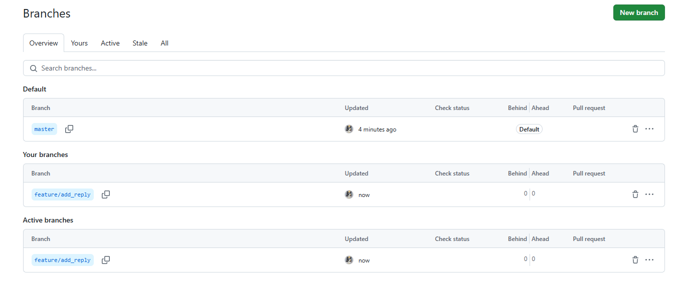
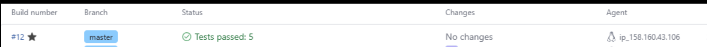
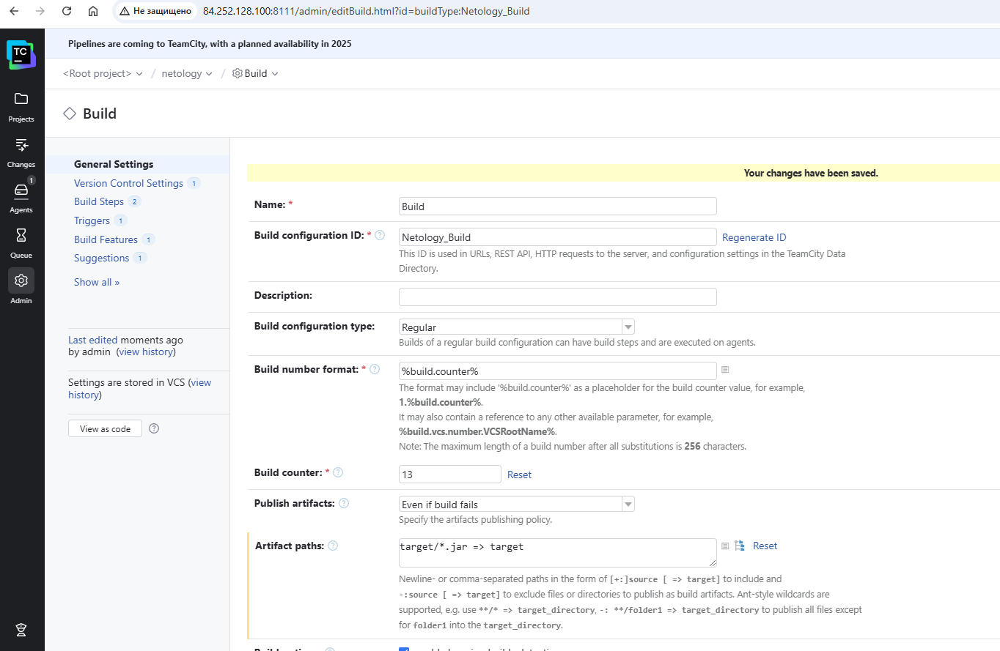
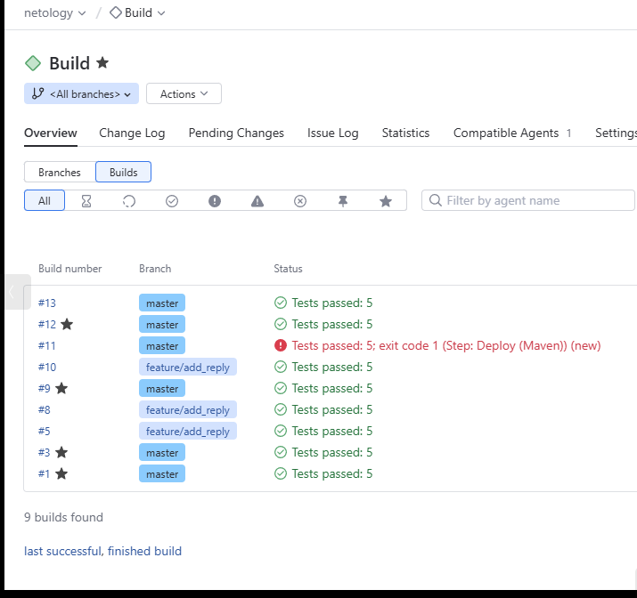
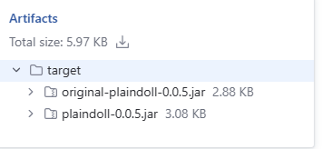

# Домашнее задание к занятию 11 «Teamcity»

## Основная часть

1. Создайте новый проект в teamcity на основе fork.  
 - Создал проект netology  
2. Сделайте autodetect конфигурации.  
  
3. Сохраните необходимые шаги, запустите первую сборку master.  
- Успешно  
4. Поменяйте условия сборки: если сборка по ветке `master`, то должен происходит `mvn clean deploy`, иначе `mvn clean test`.  
- Добавил еще одним шагом. 
  
5. Для deploy будет необходимо загрузить [settings.xml](./teamcity/settings.xml) в набор конфигураций maven у teamcity, предварительно записав туда креды для подключения к nexus.    
   
6. В pom.xml необходимо поменять ссылки на репозиторий и nexus.  
- Подготовил файл вначале.   
7. Запустите сборку по master, убедитесь, что всё прошло успешно и артефакт появился в nexus.  
   
8. Мигрируйте `build configuration` в репозиторий. 
  
9. Создайте отдельную ветку `feature/add_reply` в репозитории.  
  
10. Напишите новый метод для класса Welcomer: метод должен возвращать произвольную реплику, содержащую слово `hunter`.  
дополнил :

example-teamcity/src/main/java/plaindoll/HelloPlayer.java 

---  
```
package plaindoll;

public class HelloPlayer{
	public static void main(String[] args) {
		Welcomer welcomer = new Welcomer();
		System.out.println(welcomer.sayWelcome());
		System.out.println(welcomer.sayFarewell());
		System.out.println(welcomer.sayHunter());
	}
}
```

src/main/java/plaindoll/Welcomer.java  

--- 
```
package plaindoll;

public class Welcomer{
	public String sayWelcome() {
		return "Welcome home, good hunter. What is it your desire?";
	}
	public String sayFarewell() {
		return "Farewell, good hunter. May you find your worth in waking world.";
	}
	public String sayNeedGold(){
		return "Not enough gold";
	}
	public String saySome(){
		return "something in the way";
	}
	public String sayHunter(){
		return "See You Space Hunter";
	}

}
```

11. Дополните тест для нового метода на поиск слова `hunter` в новой реплике.  

```
	@Test
	public void welcomerSaysSpaceHunter(){
		assertThat(welcomer.sayHunter(), containsString("something"));
	}

```

12. Сделайте push всех изменений в новую ветку репозитория.  
- Done!  
13. Убедитесь, что сборка самостоятельно запустилась, тесты прошли успешно.  
 
14. Внесите изменения из произвольной ветки `feature/add_reply` в `master` через `Merge`.  
- Done!  
15. Убедитесь, что нет собранного артефакта в сборке по ветке `master`.  
- Артефакта нет.  
16. Настройте конфигурацию так, чтобы она собирала `.jar` в артефакты сборки.  
 
17. Проведите повторную сборку мастера, убедитесь, что сбора прошла успешно и артефакты собраны.

 
18. Проверьте, что конфигурация в репозитории содержит все настройки конфигурации из teamcity.  
- [Конфигурация из teamcity](https://github.com/BelcEV1985/example-teamcity/tree/master/.teamcity/Netology)
